# Cylix Demo Platform

A high-level, **buyer-friendly demo** of the Cylix offensive security & AI-driven investigation platform.

This public repository is designed for **prospective buyers, MSSPs, and security leaders** who want to:

- Understand what Cylix does and where it fits in their stack
- See **UI screenshots** of the dashboards, threat views, and AI assistants
- Review non-sensitive, public-facing documentation (overview, FAQ, evaluation guidance)

> **Important:** This repo contains **no proprietary source code**. It is strictly for demo, marketing, and documentation purposes.

---

## What is Cylix?

Cylix is an **offensive security and AI investigation platform**, not just a simple scanner.

It helps security teams:

- Continuously **simulate adversaries** and validate security controls
- **Prioritize and investigate threats** with AI copilots and guided playbooks
- Generate **executive-ready reports** on exposure, coverage, and program maturity

Designed for:

- **MSSPs / MDR providers** who need repeatable, scalable offensive capabilities
- **Enterprise red / purple teams** who want automation without losing control
- **Security leaders (CISO, VP Security)** who need clear visibility into risk and ROI

---

## What Cylix Is *Not*

Cylix is **not** just a point-and-shoot vulnerability scanner.

Instead, it focuses on:

- **Campaigns and attack chains**, not one-off checks
- **Threat-centric investigations**, not raw lists of findings
- **Continuous assurance**, not ad-hoc, once-a-year tests

---

## Key Capabilities (At a Glance)

- **Campaign builder for offensive simulations**
  - Design and run **multi-step adversary campaigns** instead of one-off checks
  - Map activity to frameworks such as **NIST CSF, MITRE ATT&CK, and OWASP**

- **Multi-tenant MSSP workflows**
  - Support for managing **many clients from a single platform**
  - Standardized playbooks and reporting so MSSPs can deliver consistent outcomes across tenants

- **AI playbooks & customizable agents**
  - AI-driven playbooks that guide investigations from alert to closure
  - Configurable agents that can be tuned to your processes and risk appetite (for example: more aggressive hunting vs. conservative triage)

- **Federated learning–oriented design**
  - Architecture designed to **learn from patterns across environments** while keeping sensitive customer data isolated
  - Helps MSSPs and multi-tenant environments benefit from shared intelligence without raw data leaving the tenant boundary

- **Threat-centric dashboards**
  - Unified view of **threats, alerts, and coverage** across the environment
  - Visual breakdowns of high-risk assets, techniques, and trends

- **Reporting & analytics modules**
  - Dedicated reporting views for:
    - Technical teams (detailed findings, campaigns, evidence)
    - Executives (summarized risk, trends, coverage)
  - Exportable output suitable for **board-level and C-level briefings**

- **Compliance & security posture support**
  - Views aligned to common frameworks to help communicate **control coverage**
  - Designed to support internal and external audits by showing how often controls are exercised and how they behave under simulated pressure

This demo repo focuses on **showing what the platform looks like and how it’s used**, not on implementation details.

---

## Architecture & Quality (High Level)

Cylix is built as a **modular, service-oriented platform**, with:

- A modern web UI and API-driven backend
- Clear separation between **control plane** and **execution/agent layers**
- Strong emphasis on **observability, logging, and testability**

The private product repository includes:

- Structured, type-aware code
- Automated tests and quality checks
- Deployment patterns suitable for modern cloud-native environments

Those details live in the private Cylix codebase and are available to qualified buyers under NDA.

---

## Screenshots (Quick Preview)

All screenshots in this repo are based on **mock / test data** only.

### Dashboards & Analytics

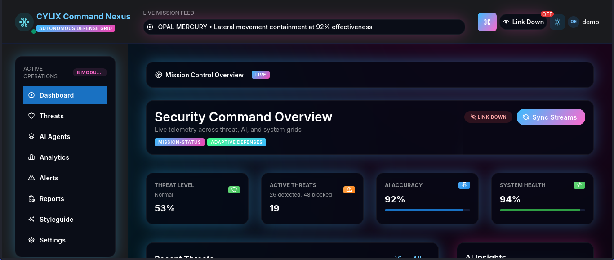

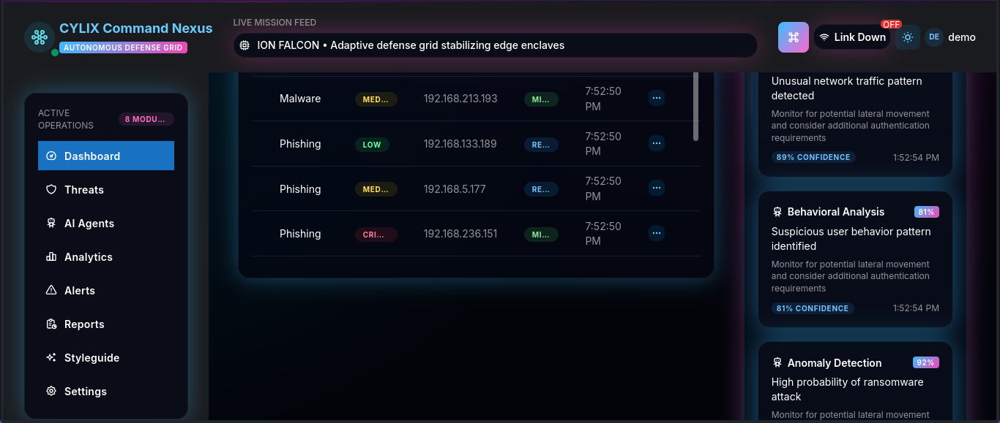

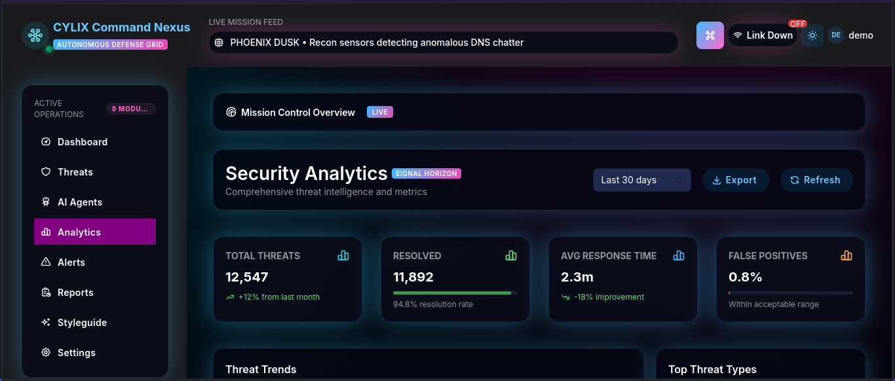

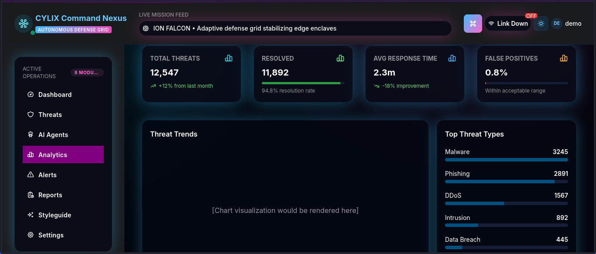

### Threat & Alert Views

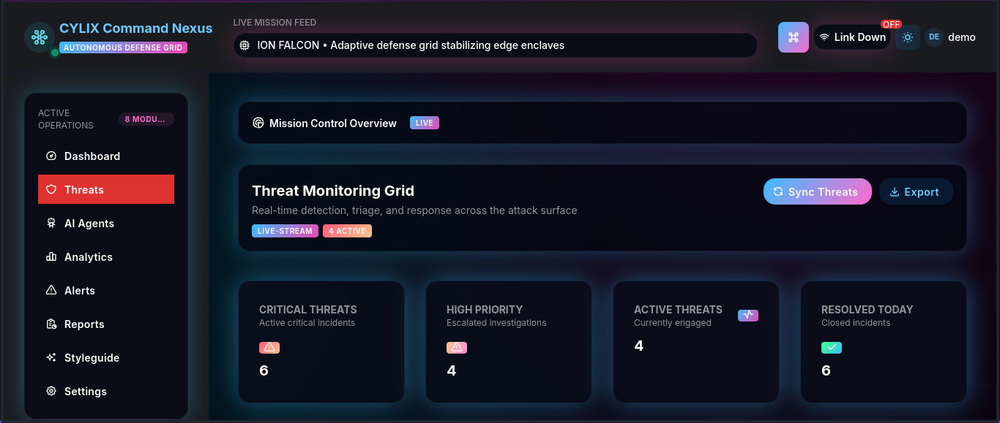

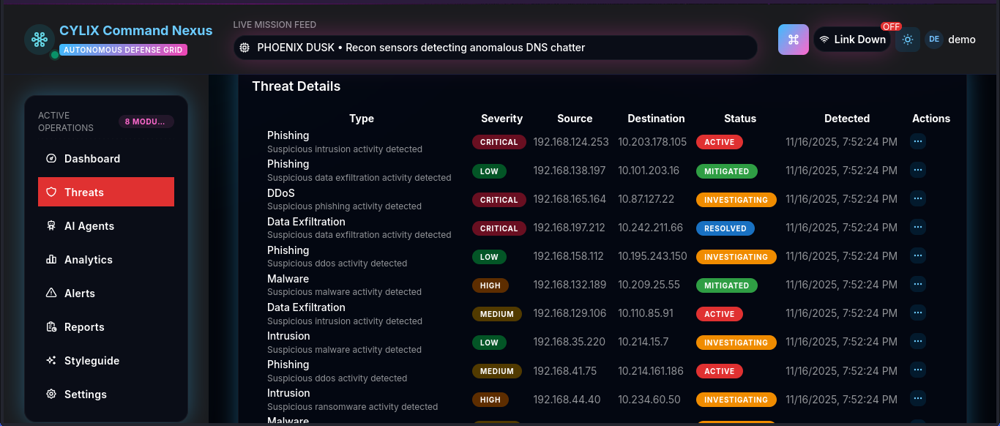

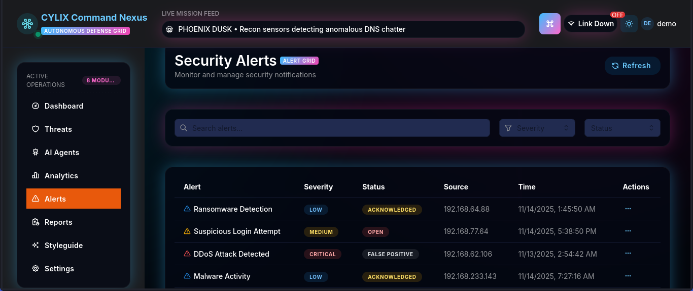

### AI, Settings & Style

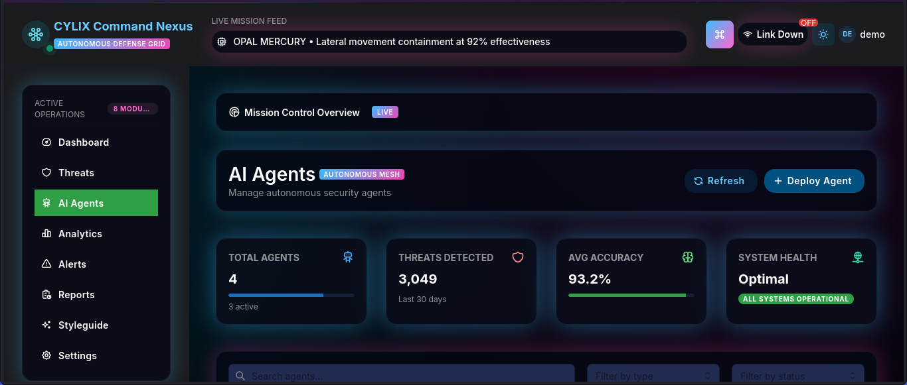

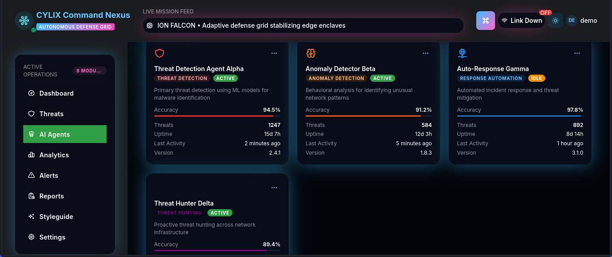

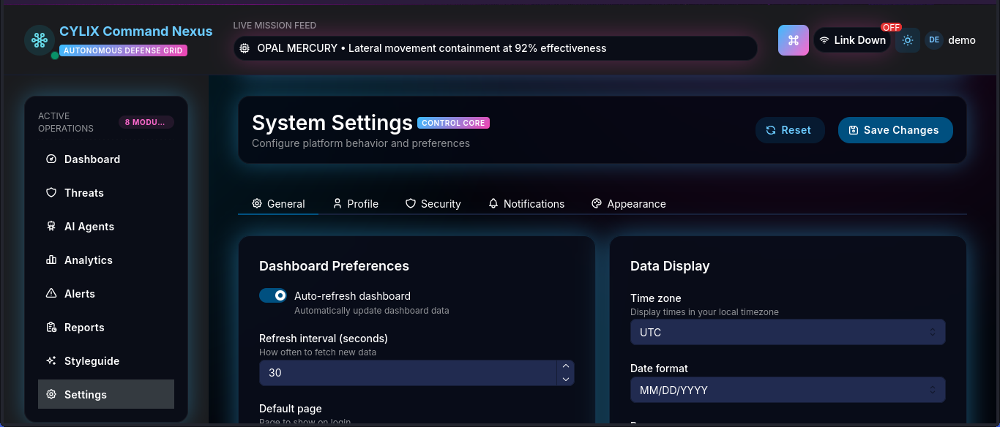

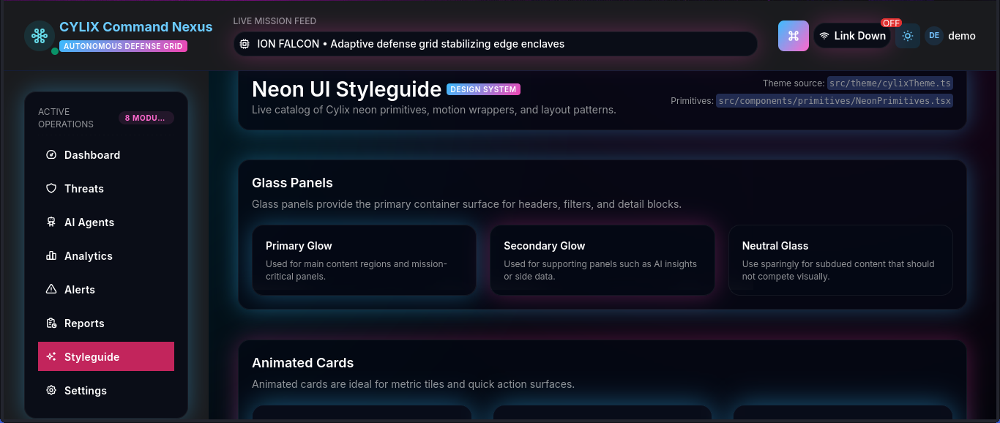

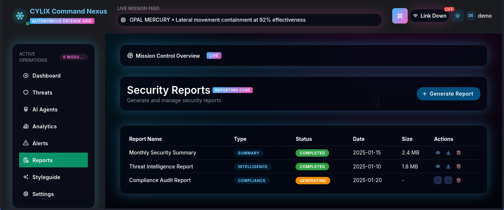

You can also browse the image files directly from the GitHub UI under:

```text
docs/assets/screenshots/
```

---

## Live Demo Site (GitHub Pages)

This repository is structured so you can host a **simple public demo site** via GitHub Pages.

- The main landing page lives at: `docs/index.md`
- It includes:
  - Product overview
  - Feature highlights
  - Screenshot gallery
  - FAQ for buyers and MSSPs

Once GitHub Pages is enabled for this repo ("Deploy from `docs/`"), visitors will see a lightweight marketing site built from these files.

---

## How to Enable GitHub Pages for This Repo

1. Go to **Settings → Pages** in `CYLIX-V2/Cylix-Demo`.
2. Under **Source**, select:
   - **Branch:** `main`
   - **Folder:** `/docs`
3. Click **Save**.
4. After a short build, your site will be available at a URL like:

   ```text
   https://cylix-v2.github.io/Cylix-Demo
   ```

(Actual URL will depend on your GitHub org/user settings.)

---

## For Buyers & MSSPs

If you are evaluating Cylix and want:

- A **guided demo** with a human from the Cylix team
- Detailed **technical documentation** and architecture
- Access to a full **evaluation or POC environment**

Please contact:

- **Website:** https://cylixsecurity.com
- **Email:** support@cylixsecurity.com

> Production code, detailed runbooks, and full architecture documentation are provided separately to qualified buyers under NDA.

---

## License & Usage

This repository contains **demo-only assets** (text, images, and sample snippets). See `LICENSE` for terms of use.

- You may use this demo site and materials to **evaluate Cylix** as a potential buyer or partner.
- You may **not** reuse, redistribute, or white-label this content without written permission from CYLIX-V2.
